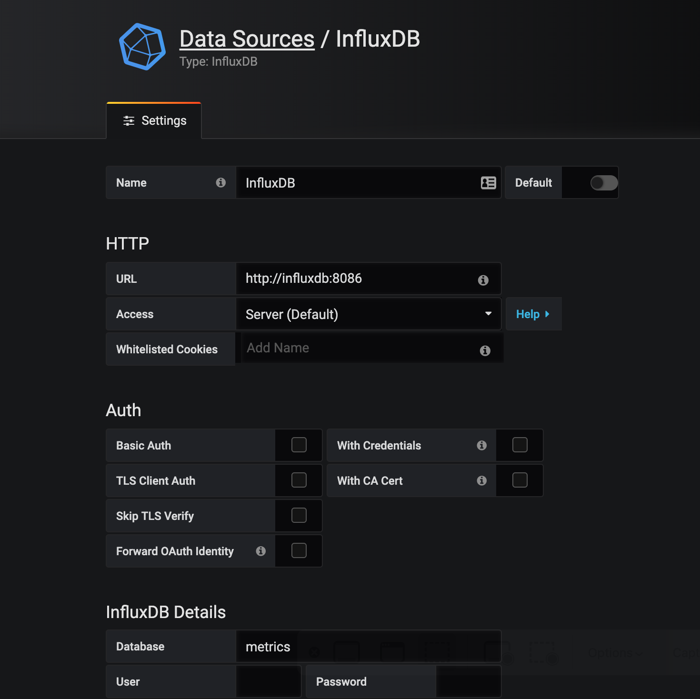

# Rumbl, monitored

Rumbl, example Phoenix application, instrumented with [Telemetry](https://github.com/beam-telemetry).

## Setup

```bash
mix deps.get
docker-compose up -d
MIX_ENV=prod mix ecto.setup
```

Go to [http://localhost:3000](http://localhost:3000) in your browser and upload the Grafana dashboard
from `dashboard.json` file. You will also need to add an InfluxDB datasource. Enter the following
details:



and save.

## Run

Run `MIX_ENV=prod iex -S mix phx.server` from the root of the repo. Then, in a different terminal,
go to `load/` subdirectory, run `iex -S mix` and call `Load.Coordinator.start/2`. The function takes
two arguments:

- `count` - the number of HTTP clients started
- `interval` - interval between individual client requests being made

If you wish to stop the load test, simply close `iex`.
